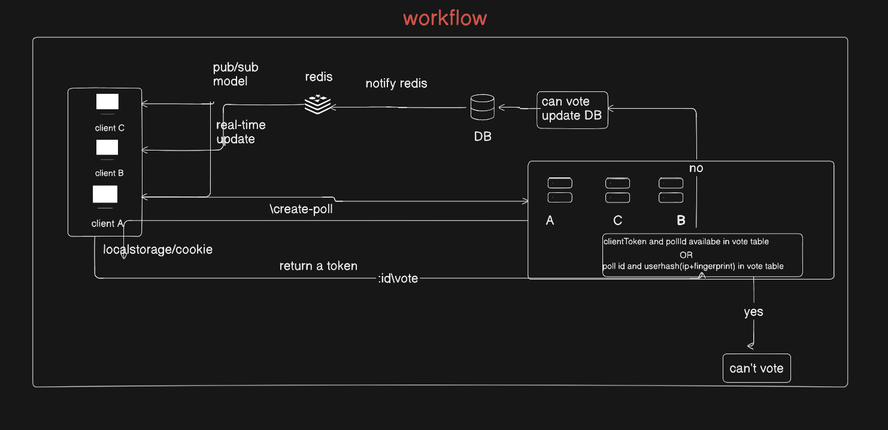
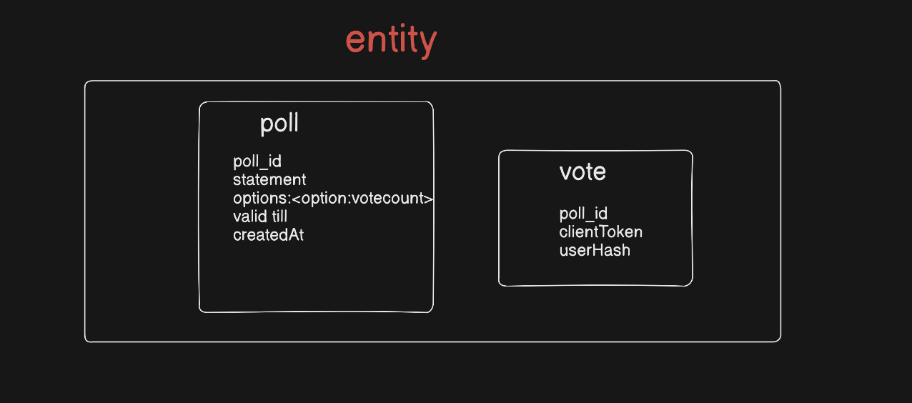

# 🗳️ Real-Time Poll Rooms

A scalable, real-time polling system that allows users to create polls, share links, vote once, and see results update instantly — with built-in fairness controls and atomic vote handling.

---

##  Live Demo
* **Public URL:** [Add your deployed link]
* **Repository:** [Add GitHub link]

---

##  Objective
This project fulfills the Real-Time Poll Rooms assignment requirements:
* Poll creation with shareable link
* Real-time vote updates
* Vote persistence
* At least two anti-abuse mechanisms
* Public deployment

The system is designed with scalability, fairness, and data integrity in mind.

---

##  Tech Stack

| Layer | Technology |
| :--- | :--- |
| **Frontend** | React |
| **Backend** | NestJS (Node.js) |
| **Database** | PostgreSQL |
| **Real-Time Engine** | Redis (Pub/Sub) |
| **Deployment** | (Your hosting provider) |

---

##  System Architecture Overview

The system ensures:
1.  **Persistent storage** in PostgreSQL.
2.  **Real-time broadcasting** via Redis.
3.  **Atomic vote processing** to prevent race conditions.
4.  **Duplicate prevention** using layered checks.

---

##  Application Flow

###  Poll Creation
User submits:
* Question
* Minimum 2 options
* Expiry time

**Backend:**
* Stores poll in PostgreSQL
* Initializes vote counts
* Generates `poll_id`
* Returns shareable link: `https://app.com/poll/{poll_id}`

###  Poll Access (Join by Link)
When a user opens the poll:
* Backend generates a `clientToken`.
* Stored in a secure cookie.
* Token identifies the session/device.
* Poll data is fetched from the DB.

###  Voting Process (Atomic Operation)
**Endpoint:** `POST /poll/:id/vote`

**Backend Validation Steps:**
1.  Check if poll exists.
2.  Check if poll is not expired.
3.  Check if user has voted before using:
    * `(poll_id + clientToken)` **OR** `(poll_id + userHash)`

---

##  Atomic Vote Mechanism
To prevent race conditions and double-click issues, the system uses a **Database Transaction**:

1.  **START TRANSACTION**
2.  Select vote record `WHERE poll_id = X AND (token = Y OR hash = Z)` **FOR UPDATE**.
3.  If exists → **ROLLBACK** (Reject).
4.  Insert new vote record.
5.  Increment vote count in the Poll table.
6.  **COMMIT**.

This guarantees no partial updates and strong concurrency safety.

---

##  Real-Time Updates Using Redis (Pub/Sub)

**Why Redis?**
Standard WebSockets fail in multi-server environments (Client A on Server 1 won't see updates from Client B on Server 2). Redis Pub/Sub acts as the "glue."

1.  **Vote Committed:** Backend publishes a message to channel `poll:{poll_id}`.
2.  **Broadcast:** All backend instances subscribed to that channel receive the event.
3.  **Push:** Instances push the update to their specifically connected WebSocket clients.

---

##  Anti-Abuse & Fairness Mechanisms

### 1. Client Token Control
* **Mechanism:** Unique UUID generated on first visit.
* **Storage:** Persistent browser cookie.
* **Impact:** Prevents simple page-refresh voting.

###  2. User Hash (Fingerprinting)
* **Mechanism:** `userHash = hash(IP + BrowserFingerprint)`
* **Details:** Includes User Agent, Resolution, and Timezone.
* **Privacy:** Only the SHA-256 hash is stored; raw IP addresses are discarded.

###  Why 100% Fairness Is Impossible
Without mandatory OAuth/Login, users can bypass controls via:
* VPNs/Tor (IP rotation)
* Incognito mode (Cookie clearing)
* Device switching

**Estimated Uniqueness Strength:** ~85–95% in standard web environments.

---

##  Database Design

### Poll Table
| Column | Type | Description |
| :--- | :--- | :--- |
| `poll_id` | UUID (PK) | Unique identifier |
| `statement` | Text | The poll question |
| `options` | JSONB | Map of options to vote counts |
| `valid_till` | Timestamp | Expiration date |

### Vote Table
| Column | Type | Description |
| :--- | :--- | :--- |
| `id` | BigInt (PK) | Auto-increment ID |
| `poll_id` | UUID (FK) | Reference to Poll |
| `client_token`| String | Cookie-based ID |
| `user_hash` | String | IP + Fingerprint hash |

---

## Future Improvements
* **CAPTCHA Integration:** Stop automated bot scripts.
* **Rate Limiting:** Limit votes per IP per minute.
* **Analysis:** Flag suspicious spikes in voting patterns.

---

##  Conclusion
This project demonstrates a production-ready approach to real-time data. By combining **PostgreSQL transactions** for integrity and **Redis** for distributed messaging, the system remains consistent and snappy even under concurrent load.